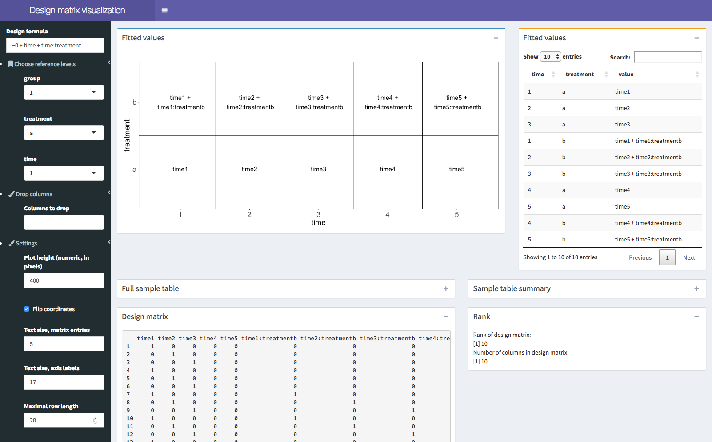

# ExploreModelMatrix

`ExploreModelMatrix` is a small R package that lets the user interactively explore a design matrix. In particular, given a table with sample information and a design formula, `ExploreModelMatrix` will illustrate the fitted values for each combination of input variables, simplifying understanding and generation of contrasts. 



## Installation

To install `ExploreModelMatrix`, run

```
remotes::install_github("csoneson/ExploreModelMatrix")
```

You need to have the `remotes` R package installed. If you don't already have it, you can install it with 

```
install.packages("remotes")
```

## Usage

To run `ExploreModelMatrix`, simply provide a _data.frame_ with sample information and a design formula:

```
sampleData <- data.frame(genotype = rep(c("A", "B"), each = 4),
                         treatment = rep(c("ctrl", "trt"), 4))
exploreModelMatrix(sampleData = sampleData,
                   designFormula = ~ genotype + treatment)

```

For more examples we refer to the vignette. 